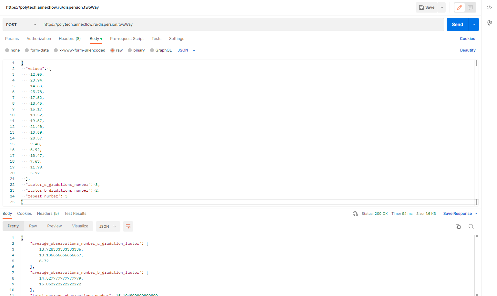

# Polytech-Math-Server

Polytech-Math-Server — сервер, выполняющий математические вычисления.

Проект написан на Kotlin.

## Оглавление

1. [Запрос](#Запрос)

2. [API Методы](#API-Методы)


### Запрос

URL Сервера: polytech.annexflow.ru



### API Методы

API Polytech-Math-Server — это интерфейс, который позволяет получить результаты вычисления с помощью http-запросов к
специальному серверу. Синтаксис запросов и тип возвращаемых ими данных строго определены на
стороне самого сервиса.

### Методы Дисперсионного анализа(Dispersion)

### + __dispersion.twoWay__ [POST]

Метод выполняющий двухфакторный дисперсионный анализ с повторениями.

#### Параметры

values : List [Double] - Список значений.

factor_a_gradations_number : Int - Число градаций фактора A.

factor_b_gradations_number : Int - Число градаций фактора B.

repeat_number : Int - Число повторений.

#### Входные данные:

```Json
{
  "values": [
    12.05,
    23.94,
    14.63,
    25.78,
    17.52,
    18.45,
    15.17,
    18.52,
    19.57,
    21.40,
    13.59,
    20.57,
    9.48,
    6.92,
    10.47,
    7.63,
    11.90,
    5.92
  ],
  "factor_a_gradations_number": 3,
  "factor_b_gradations_number": 2,
  "repeat_number": 3
}
```

|  Value  |  A#1  |  A#2  | A#3   |
|:-------:|:-----:|:-----:|-------|
| B#1 R#1 | 12.05 | 15.17 | 9.48  |
| B#1 R#2 | 23.94 | 18.52 | 6.92  |
| B#1 R#3 | 14.63 | 19.57 | 10.47 |
| B#2 R#1 | 25.78 | 21.40 | 7.63  |
| B#2 R#2 | 17.52 | 13.59 | 11.90 |
| B#2 R#3 | 18.45 | 20.57 | 5.92  |

#### Выходные данные:

Среднее число наблюдений:

average_observations_number_a_gradation_factor : Array [Double] - Среднее число наблюдений в каждой градации фактора А.

average_observations_number_b_gradation_factor : Array [Double] - Среднее число наблюдений в каждой градации фактора B.

total_average_observations_number: [Double] - Общее среднее число наблюдений.

Квадраты отклонений:

squared_sum_deviations_explained_by_factor_a : [Double] - Объясненная влиянием фактора А сумма квадратов отклонений.

squared_sum_deviations_explained_by_factor_b : [Double] - Объясненная влиянием фактора B сумма квадратов отклонений.

squared_sum_deviations_explained_by_factor_ab_interaction : [Double] - Объяснённая влиянием взаимодействия факторов A и B сумма квадратов отклонений.

squared_sum_deviations_unexplained_error : [Double] - Необъяснённая сумма квадратов отклонений или сумма квадратов отклонений ошибки.

total_squared_sum_deviations : [Double] - Общая сумма квадратов отклонений.

Числа степеней свободы:

degrees_freedom_number_explained_by_factor_a : [Double] - Число степеней свободы дисперсии, объяснённой влиянием фактора A.

degrees_freedom_number_explained_by_factor_b : [Double] - Число степеней свободы дисперсии, объяснённой влиянием фактора B.

degrees_freedom_number_explained_by_factor_ab_interaction : [Double] - Число степеней свободы дисперсии, объяснённой взаимодействием факторов A и B.

degrees_freedom_number_unexplained_variance_error : [Double] - Число степеней свободы необъяснённой дисперсии или дисперсии ошибки.

total_degrees_freedom_number : [Double] - Общее число степеней свободы.

Дисперсии:

dispersion_explained_by_factor_a : [Double] - Дисперсия, объяснённая влиянием фактора A.

dispersion_explained_by_factor_b : [Double] - Дисперсия, объяснённая влиянием фактора B.

dispersion_explained_by_factor_ab_interaction : [Double] - Дисперсия, объяснённая взаимодействием факторов A и B.

dispersion_unexplained_error : [Double] - Необъяснённая дисперсия или дисперсия ошибки.

actual_fisher_ratio_factor_a : [Double] - Фактическое отношение Фишера фактора A.

actual_fisher_ratio_factor_b : [Double] - Фактическое отношение Фишера фактора B.

actual_fisher_ratio_factor_ab : [Double] - Фактическое отношение Фишера фактора A и B.

critical_fisher_ratio_value_factor_a : [Double] - Критическое значение отношения Фишера для фактора A.

critical_fisher_ratio_value_factor_b : [Double] - Критическое значение отношения Фишера для фактора B.

critical_fisher_ratio_value_factor_ab_interaction : [Double] - Критическое значение отношения Фишера для взаимодействия факторов A и B.

is_data_depend_factor_a : [Boolean] - Зависят ли данные от фактора A с вероятностью 95%.

is_data_depend_factor_b : [Boolean] - Зависят ли данные от фактора B с вероятностью 95%.

is_data_depend_factor_ab_interaction : [Boolean] - Зависят ли данные от факторов A и B с вероятностью 95%

```Json
{
  "average_observations_number_a_gradation_factor": [
    18.728333333333335,
    18.136666666666667,
    8.72
  ],
  "average_observations_number_b_gradation_factor": [
    14.527777777777779,
    15.862222222222222
  ],
  "total_average_observations_number": 15.194999999999999,
  "squared_sum_deviations_explained_by_factor_a": 8.013338888888878,
  "squared_sum_deviations_explained_by_factor_b": 378.3808333333334,
  "squared_sum_deviations_explained_by_factor_ab_interaction": 13.850544444444404,
  "squared_sum_deviations_unexplained_error": 192.2233333333334,
  "total_squared_sum_deviations": 592.4680500000001,
  "degrees_freedom_number_explained_by_factor_a": 1.0,
  "degrees_freedom_number_explained_by_factor_b": 2.0,
  "degrees_freedom_number_explained_by_factor_ab_interaction": 2.0,
  "degrees_freedom_number_unexplained_variance_error": 12.0,
  "total_degrees_freedom_number": 17.0,
  "dispersion_explained_by_factor_a": 8.013338888888878,
  "dispersion_explained_by_factor_b": 189.1904166666667,
  "dispersion_explained_by_factor_ab_interaction": 6.925272222222202,
  "dispersion_unexplained_error": 16.018611111111117,
  "actual_fisher_ratio_factor_a": 0.5002517904520775,
  "actual_fisher_ratio_factor_b": 11.810662944144829,
  "actual_fisher_ratio_factor_ab": 0.43232663395009135,
  "critical_fisher_ratio_value_factor_a": 4.747225346722408,
  "critical_fisher_ratio_value_factor_b": 3.8852938346526167,
  "critical_fisher_ratio_value_factor_ab_interaction": 3.8852938346526167,
  "is_data_depend_factor_a": false,
  "is_data_depend_factor_b": true,
  "is_data_depend_factor_ab_interaction": false
}
```
